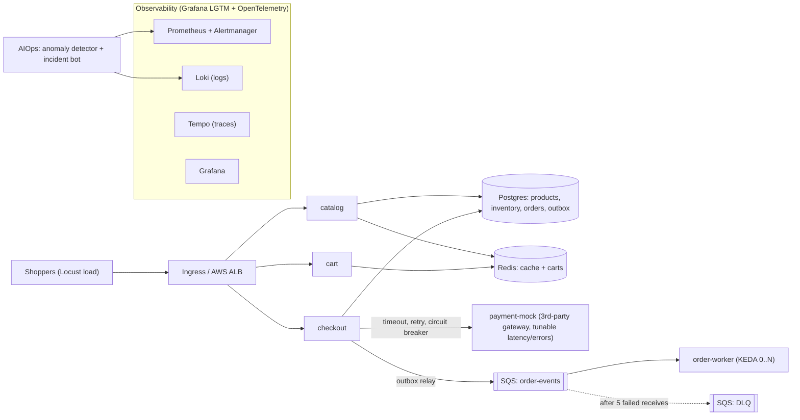

# ShopFlow — Building a Flash-Sale-Ready E-commerce Platform

> A learn-by-doing platform engineering program. You build everything; I (Claude) act as your
> tech lead: I hand out the tickets, explain concepts, review your PRs, grill you with interview
> questions and break things on purpose.

---

## 1. The business problem

You are the platform engineer at **ShopFlow**, a mid-size online retailer.

- Normal traffic: ~50 requests/sec. The whole shop runs on a couple of VMs.
- In ~13 weeks the company runs the **Midnight Mega Sale**. Marketing expects **20x peak traffic**
  for 2 hours, mostly on checkout, starting at exactly 00:00 (a thundering herd).
- Last year's sale was a disaster:
  1. The payment gateway got slow → checkout threads piled up → the **whole site** went down for 40 min.
  2. Inventory was **oversold by 300 units** because of a race condition.
  3. Nobody noticed orders had dropped until customers complained on social media (**MTTD: 25 min**).
  4. A hotfix deployed mid-sale made things worse and took 30 min to roll back.

Leadership's ask: *"Build a platform that survives the spike, degrades gracefully, tells us about
problems before customers do, deploys safely even on sale day, and doesn't burn money when the
sale is over."*

Every phase below fixes one part of that story. At the end you run a full **Game Day** sale
simulation and write the postmortem.

## 2. Success criteria (what "done" means)

| Area | Target |
|---|---|
| Checkout availability (SLO) | 99.9% non-5xx over 28 days; ≥ 99.5% during the sale window |
| Checkout latency (SLO) | p95 < 800 ms, p99 < 1.5 s at 20x load |
| Catalog latency (SLO) | p95 < 200 ms |
| Order processing freshness | 99% of orders confirmed by the worker within 60 s |
| Correctness | **Zero oversell** under concurrent checkout |
| Detection | Payment degradation detected in < 5 min (MTTD) |
| Safe delivery | Bad canary rolled back automatically in < 5 min, no human needed |
| Cost | Scales back to baseline within 30 min after the sale; "cost per 1,000 orders" reported |
| Reproducibility | Whole AWS environment from zero with one command in < 30 min; clean `destroy` |

## 3. Architecture



**Services (Python / FastAPI)** — kept small on purpose; the platform is the star, not the business logic.

| Service | Responsibility | Interesting platform problem it creates |
|---|---|---|
| `catalog` | Product listing, stock lookup | Cache-aside with Redis, serve stale cache when DB is down |
| `cart` | Cart per session in Redis | Stateful data in a stateless service, TTLs |
| `checkout` | Reserve stock → charge payment → create order + outbox row | Idempotency, race conditions, timeouts, circuit breaker, canary target |
| `payment-mock` | Pretends to be an external payment gateway | **Chaos knob**: admin endpoint sets latency / error rate / "silent failure" |
| `order-worker` | Consumes SQS, "sends" confirmation, finalizes order | KEDA queue-based scaling, scale-to-zero, DLQ, at-least-once delivery |

## 4. Where each skill shows up

| Skill | Where you'll use it for real |
|---|---|
| **Python** | 5 services, Locust load tests, AIOps anomaly detector + incident bot |
| **Docker** | Multi-stage, non-root, multi-arch images; compose for local dev |
| **Kubernetes** | kind (local, simulated 3 AZs) → EKS; probes, PDBs, spread, NetworkPolicy, rollouts |
| **Helm** | One reusable chart for all services + third-party platform charts |
| **Prometheus / Grafana** | RED + business metrics, SLOs with burn-rate alerts, dashboards-as-code |
| **Logging / Observability** | OpenTelemetry, Loki, Tempo, log↔trace↔metric correlation |
| **KEDA** | SQS scaler (scale-to-zero), Prometheus RPS scaler, cron pre-warm before the sale |
| **CI/CD** | GitHub Actions (test, scan, sign, SBOM) + Argo CD GitOps + Argo Rollouts canary |
| **Terraform** | VPC, EKS, RDS, ElastiCache, SQS, ECR, IAM, Karpenter; remote state; multi-env |
| **AWS** | EKS, RDS, ElastiCache, SQS, Secrets Manager, IAM/Pod Identity, OIDC, Budgets, FIS |
| **Ansible** | Load-generator fleet + self-hosted CI runner on EC2 (via SSM, no SSH), remediation playbooks |
| **AIOps** | Seasonality-aware anomaly detection, alert correlation, LLM incident summaries, guarded auto-remediation |
| **Other cloud native** | CloudNativePG, External Secrets, Karpenter, Chaos Mesh, Kyverno, cosign, OpenCost, Trivy |

## 5. How we work together

1. **You drive the keyboard.** I don't write your service/infra code. I explain, hint, and review.
2. **Hint ladder** when you're stuck: concept → hint → pseudocode → working snippet (only if you ask for it).
3. **Tickets.** Each phase has tickets (`SF-xxx`) with acceptance criteria. Work on a branch, open a PR,
   ask me to review it (`/code-review`). Done = acceptance criteria *demonstrably* met.
4. **Evidence.** Put proof in `docs/evidence/<phase>/` (screenshots, command output, load-test reports).
   This becomes your portfolio.
5. **ADRs.** Every non-obvious decision gets an Architecture Decision Record in `docs/adr/`.
   This is what lets you confidently answer *"why did you design it this way?"* in interviews.
6. **Break-it drills.** Every phase ends with me breaking something. You diagnose and fix it.
7. **Interview check.** Every phase ends with questions. Answer them out loud or in writing before moving on.

## 6. Environment and cost

- **Local first** (Phases 0–6): Docker Desktop + kind. Cost: $0. Your machine: 18 GB RAM, Apple Silicon.
  Raise Docker Desktop memory from 8 GB → **10–12 GB** before Phase 4 (observability stack is hungry).
- **AWS** (Phases 7+): **total budget $50.** Rough cost while the dev environment is up: ~$0.40–0.70/hour
  (EKS control plane, NAT, small nodes, RDS, ElastiCache). Always `terraform destroy` at the end of a session.

  | Phase | Planned AWS uptime | Est. cost |
  |---|---|---|
  | 7 — Terraform/EKS (lots of apply/destroy cycles) | ~20 h | ~$12 |
  | 8 — Ansible fleet | ~6 h | ~$4 |
  | 9 — Chaos, failover, restore drills | ~8 h | ~$6 |
  | 10–11 — AIOps, security, FinOps | ~10 h | ~$6 |
  | 12 — Game Day (bigger nodes + load fleet) | ~4 h | ~$8 |
  | **Buffer for mistakes** | | **~$14** |

  Guardrails (set up in SF-005, before any AWS work):
  - AWS Budget $50 with alerts at **$15, $30, $40 actual** and **$50 forecasted**.
  - Cost Anomaly Detection enabled (it's free).
  - Cost tricks: Graviton/spot nodes via Karpenter, single NAT in dev, `db.t4g.micro` single-AZ
    (switch to Multi-AZ only for the failover drill), short log retention, ECR lifecycle policy.
  - SF-709 (Phase 7): a scheduled GitHub Action that posts to Slack if an EKS cluster or NAT gateway
    still exists after midnight — your "you forgot to destroy" alarm.
  - Watch for the usual leftovers after `destroy`: orphaned load balancers, EBS volumes, Elastic IPs,
    CloudWatch log groups, RDS snapshots.
- **Slack**: workspace with `#shopflow-alerts` (Alertmanager) and `#shopflow-incidents` (incident bot, Game Day).
  Webhook URLs are secrets — never commit them.
- **Apple Silicon gotcha**: your laptop builds `arm64` images; EKS nodes may be `amd64`. You'll hit
  `exec format error` if you ignore this — that's intentional learning (Phase 2).

## 7. Repository layout (target)

```
service-platform/
├── services/                 # catalog, cart, checkout, payment-mock, order-worker
│   └── <svc>/{app/,tests/,Dockerfile,pyproject.toml}
├── libs/shopflow-common/     # shared logging, metrics, tracing, config helpers
├── deploy/
│   ├── charts/service/       # ONE generic Helm chart for all services
│   ├── platform/             # values for argocd, keda, kube-prometheus-stack, loki, tempo, chaos-mesh...
│   └── envs/{local,dev,prod}/# per-env values + Argo CD Applications
├── infra/terraform/
│   ├── bootstrap/            # state bucket, budget
│   ├── modules/{network,eks,data,ecr,iam}/
│   └── envs/{dev,prod}/
├── ansible/{inventories,roles,playbooks}/
├── observability/{dashboards,alerts,slos}/
├── aiops/{anomaly-detector,incident-bot}/
├── loadtest/locust/
├── chaos/experiments/
├── docs/{adr,runbooks,postmortems,evidence}/
├── .github/workflows/
└── Makefile
```

---

## 8. The phases

Pace: **10 hours/week → ~13 weeks.** A rhythm that works: two 2-hour weekday sessions (build tickets)
plus one 6-hour weekend block (break-it drill, PR review, interview check, ADRs, AWS sessions).
Go slower rather than skip the drills.

### Phase 0 — Foundations (week 1)

*Scenario: Day one on the team. Set up a repo that other engineers could join tomorrow.*

- [ ] **SF-001** `git init`, push to GitHub, protect `main` (PR required, checks required).
- [ ] **SF-002** `pre-commit` with ruff, yamllint, `terraform fmt`, gitleaks. `Makefile` with `help`, `lint`, `test`.
- [ ] **SF-003** `docs/adr/0001-record-architecture-decisions.md` using the MADR template. ADR-0002: monorepo vs polyrepo.
- [ ] **SF-004** Install tooling: `uv`, `ansible`, `k9s`, `kubectx`, `trivy`, `tflint`, `kubeconform`, `argocd`, `pre-commit`.
- [ ] **SF-005** AWS account hygiene: MFA on root then stop using root, IAM Identity Center (or an admin user with MFA),
  `aws configure sso` profile, $50 budget with alerts (see section 6), Cost Anomaly Detection.
- [ ] **SF-006** Slack workspace + `#shopflow-alerts` and `#shopflow-incidents` channels.

**Acceptance:** a teammate can clone, run `make help`, and understand the project from the README in 5 minutes.

**Interview check:** Why a monorepo here, and when would you split it? What does branch protection actually protect you from?

---

### Phase 1 — The services (weeks 1–2)

*Scenario: Rebuild the shop as small services so each part can scale and fail independently — and fix last year's oversell bug.*

- [ ] **SF-101** `catalog`: `GET /products`, `GET /products/{id}`. Postgres + Redis cache-aside with TTL.
- [ ] **SF-102** `cart`: add/remove/get cart in Redis, 24h TTL.
- [ ] **SF-103** `checkout`: `POST /checkout` with an `Idempotency-Key` header.
  - Reserve stock **atomically** (hint: a conditional `UPDATE ... WHERE qty >= n`, check affected rows).
  - Call payment with a **timeout**, **retries with jittered backoff**, and a **circuit breaker**.
  - Write the order **and** an outbox row in **one transaction**; a relay publishes outbox rows to SQS.
- [ ] **SF-104** `payment-mock`: admin endpoint to set latency, error rate, and a "silent failure" mode (returns 200 but declines).
- [ ] **SF-105** `order-worker`: long-poll SQS, process idempotently, delete on success; DLQ after 5 receives.
- [ ] **SF-106** Cross-cutting (put in `libs/shopflow-common`): `/healthz` (liveness) vs `/readyz` (dependencies),
  JSON logs with `trace_id`, Prometheus `/metrics`, OpenTelemetry auto-instrumentation, graceful SIGTERM, config from env vars only.
- [ ] **SF-107** Tests: pytest unit tests + one concurrency test. Local SQS via LocalStack.

**Acceptance:**
- 50 concurrent checkouts on a SKU with stock 10 → **exactly 10 succeed**, stock = 0, never negative.
- Replaying the same `Idempotency-Key` never creates a second order or a second charge.
- Worker crash mid-message → message is redelivered and processed exactly once *in effect*.

**Break it:** I'll set payment latency to 5 s. Does checkout hang? Do catalog and cart stay healthy?

**Interview check:** Explain the dual-write problem and why the outbox pattern solves it. Liveness vs readiness — what goes wrong if readiness checks the DB but liveness does too? At-least-once vs exactly-once delivery?

---

### Phase 2 — Containers (week 2)

*Scenario: Security review flagged the old images: 1.2 GB, running as root, 40 critical CVEs.*

- [ ] **SF-201** Multi-stage Dockerfile per service: slim base, locked deps, non-root user, `.dockerignore`.
- [ ] **SF-202** Multi-arch builds (`linux/amd64,linux/arm64`) with `docker buildx`.
- [ ] **SF-203** `docker-compose.yml`: all services + Postgres + Redis + LocalStack, with healthcheck-based `depends_on`.
- [ ] **SF-204** Trivy scan: zero CRITICAL. Image size < 150 MB.

**Acceptance:** `docker compose up` → a Locust smoke test places 100 orders; worker processes all 100.

**Break it:** I'll hand you an image built only for arm64 and deploy it to amd64. Diagnose it.

**Interview check:** Why do layer order and `.dockerignore` matter for build speed? Distroless vs slim trade-offs? What does PID 1 have to do with graceful shutdown?

---

### Phase 3 — Kubernetes locally (week 3)

*Scenario: Move off VMs. The cluster must survive losing a node or a whole availability zone.*

- [ ] **SF-301** kind cluster: 1 control plane + 3 workers labeled with `topology.kubernetes.io/zone` = a/b/c.
- [ ] **SF-302** ingress-nginx (or Gateway API). Postgres via the **CloudNativePG** operator (1 primary + 1 replica). Redis. LocalStack.
- [ ] **SF-303** **One generic Helm chart** `deploy/charts/service` used by all 5 services via per-service values:
  Deployment, Service, probes, requests/limits, securityContext, `topologySpreadConstraints`, PDB, HPA, NetworkPolicy, ServiceMonitor (for Phase 4).
- [ ] **SF-304** Default-deny NetworkPolicies; only allowed paths open. Prove enforcement with a test pod.
- [ ] **SF-305** Zero-downtime rollout: `preStop` + `terminationGracePeriodSeconds` tuned; rolling update under load with 0 errors.

**Acceptance:** Locust running at steady load while you (a) roll out a new version, (b) drain a node, (c) cordon + drain all of zone `a` → error rate stays < 0.1%.

**Break it:** OOMKilled pod, a CrashLoopBackOff from a bad config, and a Service with a wrong selector. Diagnose each with `kubectl` only.

**Interview check:** Requests vs limits and CPU throttling? Why a PDB and what does it *not* protect against? What happens, step by step, when a pod is deleted during a rolling update?

---

### Phase 4 — Observability (weeks 4–5)

*Scenario: Last year MTTD was 25 minutes. Make sure the platform tells you before customers do.*

- [ ] **SF-401** kube-prometheus-stack; ServiceMonitors from your chart.
- [ ] **SF-402** OpenTelemetry Collector → **Tempo** (traces); Grafana Alloy → **Loki** (logs).
  Click from a log line → its trace, and from a latency spike (exemplar) → a trace.
- [ ] **SF-403** Business metrics: `orders_placed_total`, `checkout_failures_total{reason}`, `revenue_cents_total`, payment latency histogram.
- [ ] **SF-404** Dashboards **as code** in `observability/dashboards/`: a "Sale Command Center" (RPS, error ratio, p95/p99, orders/min, queue depth, pods, SLO burn).
- [ ] **SF-405** SLOs as Prometheus recording rules + **multi-window, multi-burn-rate** alerts (write them by hand first, then compare with Pyrra or Sloth).
- [ ] **SF-406** Alertmanager → Slack (free workspace) with grouping and inhibition. Every alert has a `runbook_url` → `docs/runbooks/`.

**Acceptance:** With payment latency set to 3 s, a page fires in < 5 min, and you go alert → dashboard → trace → log line in < 3 min.

**Break it:** I'll add a `user_id` label to a metric. Find the cardinality explosion and explain its cost.

**Interview check:** RED vs USE? Why alert on SLO burn rate instead of "CPU > 80%"? Histograms vs summaries? How do logs, metrics and traces get correlated?

---

### Phase 5 — Load testing and autoscaling with KEDA (week 6)

*Scenario: Prove the platform can take 20x. "It should scale" is not a capacity plan.*

- [ ] **SF-501** Locust sale profile: 70% browse, 20% cart, 10% checkout; ramp from 1x → 20x in 2 minutes at "midnight".
- [ ] **SF-502** Baseline with CPU-based HPA. Record where it breaks.
- [ ] **SF-503** KEDA: `aws-sqs-queue` scaler for `order-worker` (LocalStack now, real SQS later) with **scale-to-zero**.
- [ ] **SF-504** KEDA `prometheus` scaler on RPS-per-pod for `checkout`. Tune HPA behavior (stabilization windows, scale-up policies).
- [ ] **SF-505** KEDA `cron` scaler to **pre-warm** 15 min before the sale (what real retailers do).
- [ ] **SF-506** Write `docs/capacity-plan.md`: pods per 100 RPS per service, DB connection budget, bottleneck list.

**Acceptance:** Local target (e.g. 10x of your local baseline) sustained with SLOs green; worker lag < 60 s; scale back to baseline within 10 min.

**Break it:** Autoscaling to 40 checkout pods exhausts Postgres connections and everything falls over. Fix it (pool sizing, PgBouncer via CloudNativePG `Pooler`).

**Interview check:** Why is CPU a poor scaling signal for I/O-bound services? How does KEDA relate to HPA? What limits scaling that autoscaling can't fix?

---

### Phase 6 — CI/CD and GitOps (week 7)

*Scenario: Last year's mid-sale hotfix made things worse. Deploys must be boring, auditable, and self-reverting.*

- [ ] **SF-601** GitHub Actions, path-filtered per service: ruff → pytest → buildx (with cache) → Trivy → SBOM (syft) → cosign keyless sign → push to GHCR. Tags = git SHA, never `latest`.
- [ ] **SF-602** Chart CI: `helm lint`, `helm template | kubeconform`.
- [ ] **SF-603** Argo CD in kind: ApplicationSet for services + app-of-apps for platform components. CI bumps the image tag via PR; Argo CD syncs.
- [ ] **SF-604** **Argo Rollouts** canary for `checkout`: 10% → 30% → 60% → 100% with an `AnalysisTemplate` on Prometheus error ratio and p95.
- [ ] **SF-605** Sale-day **change freeze** via Argo CD sync windows (with a documented break-glass process).

**Acceptance:** Merge a build where checkout returns 500 on 5% of requests → the canary aborts and rolls back on its own, with an alert explaining why.

**Interview check:** Push-based vs pull-based deploys? How do you promote dev → prod in GitOps? What goes in CI vs CD? Why sign images and who verifies the signature?

---

### Phase 7 — AWS with Terraform (weeks 8–9)

*Scenario: Leadership approved AWS. Everything must be code, reviewable, repeatable, and cheap to tear down.*

- [ ] **SF-701** `bootstrap/`: S3 state bucket (versioned, encrypted) with S3 native locking (`use_lockfile = true`), budget alarm.
- [ ] **SF-702** `modules/network`: VPC across 3 AZs, public/private subnets, one NAT in dev (ADR: cost vs HA).
- [ ] **SF-703** `modules/eks`: EKS + small managed node group for system pods; **Karpenter** for workloads (spot + on-demand fallback).
- [ ] **SF-704** `modules/data`: RDS Postgres (Multi-AZ in prod), ElastiCache Redis, SQS + DLQ, ECR.
- [ ] **SF-705** `modules/iam`: EKS **Pod Identity** (or IRSA), least privilege per service (the worker can only receive/delete on *its* queue).
- [ ] **SF-706** Cluster add-ons: AWS Load Balancer Controller, **External Secrets Operator** ← Secrets Manager, KEDA using Pod Identity.
- [ ] **SF-707** Point Argo CD at EKS; reuse the same charts with `envs/dev` values.
- [ ] **SF-708** Terraform CI: GitHub **OIDC** → AWS role (no static keys); `plan` posted on PR; `apply` after approval; tflint + checkov; nightly drift detection.

**Acceptance:** From an empty account: one command → shop running on EKS in < 30 min. `terraform destroy` leaves nothing billable. `grep` the repo: zero AWS keys.

**Break it:** I change a security group in the console → catch it with drift detection. Kill a node → Karpenter replaces it.

**Interview check:** How does state locking work and why does it matter? Modules vs workspaces vs directories for environments? IRSA vs Pod Identity? Karpenter vs Cluster Autoscaler?

---

### Phase 8 — Ansible (week 9)

*Scenario: Load-testing 20x from inside the cluster lies to you. You need an external load-generator fleet and a self-hosted CI runner — plain EC2, not Kubernetes.*

- [ ] **SF-801** Terraform creates EC2 instances tagged `role=loadgen` / `role=runner`. **Terraform provisions, Ansible configures.**
- [ ] **SF-802** Dynamic inventory (`amazon.aws.aws_ec2`) + SSM connection plugin — **no SSH keys, no port 22**.
- [ ] **SF-803** Roles: `common` (hardening, node_exporter, time sync), `locust_worker`, `gh_runner`. Secrets via Ansible Vault or SSM Parameter Store.
- [ ] **SF-804** Molecule tests for roles; idempotency check (second run → `changed=0`).
- [ ] **SF-805** A remediation playbook (e.g. flush a poisoned cache key, rotate a load-gen fleet) that Phase 10 will call.

**Acceptance:** One command spins up and configures a distributed Locust fleet that drives load at your AWS target.

**Interview check:** Where does Ansible still fit in a Kubernetes-first world (write the ADR)? Push vs pull config management? What makes a task idempotent?

---

### Phase 9 — Resilience and chaos engineering (week 10)

*Scenario: Prove last year's cascading failure can't happen again — with experiments, not hope.*

- [ ] **SF-901** Install **Chaos Mesh**. Each experiment in `chaos/experiments/` has: hypothesis, blast radius, abort condition, result.
- [ ] **SF-902** Experiments: kill checkout pods under load; 2 s latency on payment; packet loss to Redis; lose zone `a`; CPU stress on a node.
- [ ] **SF-903** Graceful degradation: catalog serves stale cache when Postgres is down; checkout fails fast (circuit open) with a friendly error instead of hanging.
- [ ] **SF-904** Data: RDS failover test, Redis failover, **restore drill** from snapshot/PITR — measure real RTO/RPO.
- [ ] **SF-905** Optional: AWS FIS spot-interruption or AZ-power-interruption experiment.

**Acceptance:** Payment gateway down → catalog and cart unaffected; checkout degrades cleanly; SLO impact matches your hypothesis.

**Interview check:** Retry storms and how to prevent them? Bulkheads vs circuit breakers? What's the difference between RTO and RPO, and what were yours?

---

### Phase 10 — AIOps (week 11)

*Scenario: The scariest incident is the silent one — payment returns 200 but declines everything. No error rate, no latency spike. Revenue just stops.*

- [ ] **SF-1001** `aiops/anomaly-detector` (Python): every minute, query Prometheus for orders/min, traffic, conversion rate.
  Build a **seasonality-aware baseline** (EWMA / rolling z-score / same-hour-last-week; optionally IsolationForest or Prophet).
  Backtest on synthetic data; report precision/recall and false-alarm rate.
- [ ] **SF-1002** Alert correlation: Alertmanager webhook → group alerts by service dependency graph + time window + recent deploys (Argo CD notifications) → one incident.
- [ ] **SF-1003** LLM incident summary: gather firing alerts, top errors from Loki (LogQL), recent deploys, a sample trace → Claude API → Slack message with a summary, likely cause and the matching runbook. Read-only.
- [ ] **SF-1004** Guarded auto-remediation: an **allowlist** only (abort a rollout, scale up, restart a pod, disable a feature flag) with rate limits, dry-run mode and an audit log. Everything else is suggest-only.

**Acceptance:** Turn on payment "silent failure" → detector fires in < 5 min with **no static threshold**; the summary points at payment/checkout and the most recent related change.

**Interview check:** Why do static thresholds fail for e-commerce traffic? How would you stop an auto-remediation from making an incident worse? Where should an LLM *not* be in the incident loop?

---

### Phase 11 — Security and FinOps hardening (week 12)

*Scenario: Security wants guardrails; finance wants to know what the sale cost.*

- [ ] **SF-1101** **Kyverno** policies: no root, no `latest`, requests/limits required, only cosign-signed images from your registry.
- [ ] **SF-1102** Pod Security Standards `restricted`; gitleaks in CI; IAM Access Analyzer review.
- [ ] **SF-1103** **OpenCost**: cost per namespace/service; spot vs on-demand savings; VPA in recommend mode for rightsizing.
- [ ] **SF-1104** Scale non-prod to zero at night (KEDA cron + Karpenter consolidation).
- [ ] **SF-1105** Publish **cost per 1,000 orders** on the Command Center dashboard.

**Interview check:** Admission control vs CI scanning — why both? How would you cut this platform's bill by 40% without hurting SLOs?

---

### Phase 12 — Game Day capstone (week 13)

*Scenario: It's sale night.*

1. T-30 min: change freeze starts (Argo CD sync window). KEDA cron pre-warms.
2. T-0: the Ansible-managed Locust fleet drives 20x traffic at EKS.
3. Mid-sale: **I inject two surprise failures** (you won't know which). You run the incident: detect, triage, mitigate, communicate in Slack.
4. T+2h: load drops; verify scale-down and cost return to baseline.

**Deliverables (your portfolio):**
- [ ] Blameless postmortem in `docs/postmortems/` (timeline, impact, root cause, what went well, action items).
- [ ] SLO report, capacity report, cost report for the sale.
- [ ] Top-level README: problem → architecture diagram → decisions (ADR index) → results with numbers → dashboard screenshots.
- [ ] A 3–5 minute demo video and a write-up (blog/LinkedIn) telling the story: *"How I made a shop survive 20x traffic."*

---

## 9. ADRs you should end up with

| # | Decision |
|---|---|
| 0001 | Record architecture decisions |
| 0002 | Monorepo vs polyrepo (and where the GitOps env config lives) |
| 0003 | SQS vs Kafka vs RabbitMQ for order events |
| 0004 | Outbox pattern vs dual writes |
| 0005 | Grafana LGTM + OpenTelemetry vs ELK/OpenSearch |
| 0006 | KEDA vs HPA with custom metrics adapter |
| 0007 | Pull-based GitOps (Argo CD) vs push deploys from CI |
| 0008 | Karpenter vs Cluster Autoscaler |
| 0009 | EKS Pod Identity vs IRSA |
| 0010 | Where Ansible fits in a Kubernetes-first platform |
| 0011 | Single NAT (dev) vs NAT per AZ (prod): cost vs availability |
| 0012 | Guardrails for AIOps auto-remediation |

## 10. Progress log

| Date | Phase / ticket | What I learned | Evidence |
|---|---|---|---|
| | | | |
